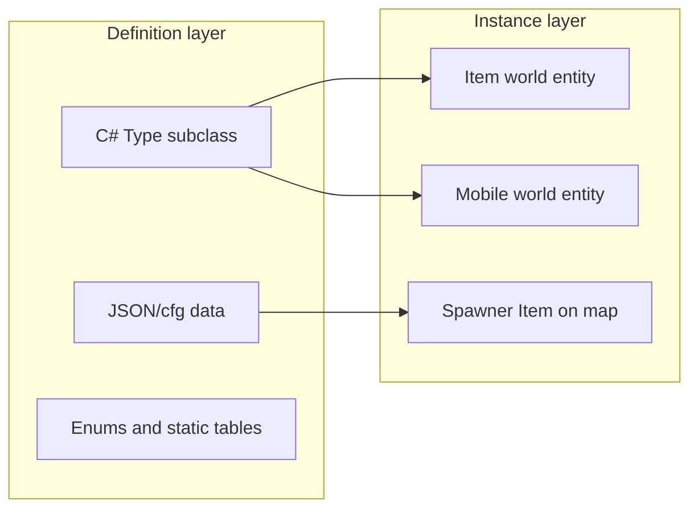

# ModernUO Content Taxonomy

## When This Activates

- Planning new game content or scoping a feature request
- Classifying where a piece of content belongs in the codebase
- Migrating RunUO scripts and deciding which ModernUO system to target
- Cross-referencing era docs (`dev-docs/eras/`) with implementation locations
- Answering "where do I implement X?" for any UO content type
- Parity audit or inventory against official UO (UO.com, UOGuide)
- Comparing ModernUO implementation status to OSI for any taxonomy domain

## Mandatory Output Contract

**Every activation** must emit the full report from [parity-check.md](parity-check.md):

1. **Bestandsaufnahme** — 9-domain matrix (World through ClientPresentation)
2. **Fehlend (Gap)** — missing or unwired OSI content
3. **Unvollständig** — `Partial`, `SourceLocked`, or `RuntimeBlocked` items
4. **Enhanced** — intentional RebirthUO deviations from OSI
5. **Fokus dieser Anfrage** — taxonomy classification and implementation paths
6. **Offene Punkte / Recherche** — unresolved conflicts or items needing web search

7. **Issue Slice Options** - Markdown follow-up option to turn findings into single sliced issues

Run the parity workflow **before** classification advice. Use web search only when UO.com and UOGuide do not resolve open points.

## Parity Check

Full workflow, source hierarchy, status legend, domain URLs, and report template:

→ [parity-check.md](parity-check.md)

Primary external sources: **UO.com** wiki and **UOGuide**. Repo parity claims live in `dev-docs/eras/`; ML URLs in `Projects/UOContent/Misc/MondainsLegacySourceReferences.cs`.

## Markdown Delivery and Issue Slicing

Deliver the final parity report as Markdown. End every report with `## Issue Slice Options` and offer to turn findings into single sliced issues.

Only create issue drafts or tracker issues when the user asks. When slicing is requested, create one independently actionable Markdown issue per gap, partial implementation, runtime blocker, enhanced-deviation decision, or unresolved research decision. Each issue slice should include:

- Title.
- Source report row, taxonomy domain, or stable decision ID.
- Expected OSI behavior with cited source.
- ModernUO evidence with file path, line, or search evidence.
- Impact/risk category.
- Proposed decision direction, without code patches unless already approved.
- Acceptance criteria and suggested validation.
- Open questions or source conflicts.

Do not bundle unrelated findings into one issue just because they belong to the same domain.

## Taxonomy Tree

- **World**
  - Facet
  - Region
  - Dungeon
  - Town
  - StaticPlacement
  - MultiDefinition
  - TeleportLink
  - HousingArea
  - ResourceArea
- **Entity**
  - ItemDefinition
  - ItemInstance
  - MobileDefinition
  - MobileInstance
  - SpawnerDefinition
  - ControllerDefinition
- **ItemSystem**
  - ItemCategory
  - ItemPropertyDefinition
  - MaterialDefinition
  - DurabilityRule
  - LootType
  - EquipmentLayer
  - ArtifactDefinition
  - SetItemDefinition
- **MobileSystem**
  - MobileCategory
  - AIProfile
  - CreatureAbility
  - TamingProfile
  - VendorProfile
  - TrainerProfile
  - LootProfile
  - CorpseProfile
- **Progression**
  - SkillDefinition
  - StatDefinition
  - SpellDefinition
  - AbilityDefinition
  - MasteryDefinition
  - VirtueDefinition
  - StatusEffectDefinition
  - TitleDefinition
- **EconomyCrafting**
  - ResourceDefinition
  - HarvestRule
  - CraftRecipe
  - ToolDefinition
  - BulkOrderTemplate
  - VendorInventory
  - RewardStore
  - CurrencyOrToken
- **QuestNarrative**
  - QuestDefinition
  - QuestStep
  - QuestObjective
  - QuestGiver
  - QuestItemRequirement
  - DialogueNode
  - RewardTable
  - AccessUnlock
- **Encounter**
  - SpawnTable
  - LootTable
  - TreasureMapTemplate
  - TreasureChestTemplate
  - ChampionSpawnDefinition
  - BossEncounter
  - EventDefinition
- **ClientPresentation**
  - ArtAsset
  - AnimationAsset
  - SoundAsset
  - Hue
  - Gump
  - ClilocString
  - Icon

## Core ModernUO Pattern

Taxonomy names are **design vocabulary** — they do not exist as C# types in this repo.

- **Definition** ≈ `System.Type` + ctor defaults, or JSON/cfg rows
- **Instance** ≈ `Item` / `Mobile` registered in `World`
- **Profiles** (loot, AI, vendor, taming) ≈ virtual overrides on `BaseCreature` / `BaseVendor`, not separate definition types

ModernUO uses **type-per-content**: each sword, creature, or quest line is typically its own C# subclass plus shared enums and base classes.

## Classification Workflow

Use this checklist before writing code:

0. **Emit Bestandsaufnahme report** — full 9-domain parity matrix + Gap / Partial / Enhanced lists ([parity-check.md](parity-check.md))
1. **Spatial / world rules?** → World
2. **New thing placed in the world?** → Entity first, then the domain system
3. **Item mechanics / properties / gear rules?** → ItemSystem
4. **Creature behavior / NPC roles?** → MobileSystem
5. **Player growth (skills, spells, virtues)?** → Progression
6. **Gathering / crafting / vendors / economy?** → EconomyCrafting
7. **Story / quests / dialogue?** → QuestNarrative
8. **Spawns, bosses, scheduled events?** → Encounter
9. **Client IDs, UI, strings, icons?** → ClientPresentation

When multiple domains apply, start with **Entity** (what exists in the world), then layer domain systems (e.g. a new boss = MobileDefinition + BossEncounter + LootProfile + ArtAsset).

## World Bootstrap Order

Relevant when placing content that depends on map/region data (`dev-docs/server-lifecycle.md`):

1. `MapLoader` → `Distribution/Data/map-definitions.json`
2. `TileMatrixLoader` → client map/static files
3. `RegionJsonSerializer` → `Distribution/Data/regions.json`
4. `MultiData.Configure()` → client multi files
5. Decoration, teleporters, spawns → **manual** (`[Decorate]`, `[TelGen]`, spawner import)

## Cross-Links

| Domain | Primary skill / doc |
|---|---|
| World | `modernuo-regions.md`, `dev-docs/regions.md` |
| Entity + items / mobiles | `modernuo-content-patterns.md` |
| Item properties | `modernuo-property-lists.md` |
| Progression spells | `modernuo-content-patterns.md` |
| Quest engines | `Projects/UOContent/Engines/ML Quests/`, `Projects/UOContent/Engines/Quests/` |
| Encounter events | `modernuo-event-scheduler.md`, `modernuo-timers.md` |
| ClientPresentation gumps | `modernuo-gump-system.md` |
| Strings / cliloc | `modernuo-string-handling.md` |
| Era scoping | `modernuo-era-expansion.md`, `dev-docs/eras/README.md` |
| Parity / inventory | [parity-check.md](parity-check.md), `dev-docs/eras/`, `MondainsLegacySourceReferences.cs` |
| Serialization | `modernuo-serialization.md` |
| RunUO migration | `migrate-from-runuo/migrate-foundation.md` |

## Concept → Code Mappings

Full per-concept tables with ModernUO equivalents, key paths, and gap notes:

→ [mappings.md](mappings.md)

## Quick Reference (Common Tasks)

| Task | Start here |
|---|---|
| Add a dungeon zone | World → Region / Dungeon; `regions.json` + `DungeonRegion` |
| Place static decor | World → StaticPlacement; `Data/Decoration/**/*.cfg` + `[Decorate]` |
| Add a creature | Entity → MobileDefinition; new class under `Mobiles/` |
| Configure spawns | Entity → SpawnerDefinition; `Data/Spawns/**/*.json` |
| Add loot to a mob | MobileSystem → LootProfile; `GenerateLoot()` + `LootPack` |
| Add a craftable item | EconomyCrafting → CraftRecipe; `Engines/Craft/Def*.cs` |
| Add an ML quest | QuestNarrative → QuestDefinition; `Engines/ML Quests/Definitions/` |
| Add a peerless boss | Encounter → BossEncounter; `Engines/Peerless/` |
| Add a champion spawn | Encounter → ChampionSpawnDefinition; `ChampionSpawnInfo` |
| Show a dialog UI | ClientPresentation → Gump; `Gumps/` + `modernuo-gump-system.md` |

## How to Report Issues

When this skill finds a problem or leaves an uncertainty, report the smallest reproducible evidence:

- Task or trigger that activated the skill.
- Relevant repository path and line, or external source URL/date when parity research is involved.
- Risk category: save compatibility, client behavior, performance, economy, security, era parity, or operator workflow.
- Validation performed, including commands run or why a runtime/manual check is still needed.
- Open questions or source conflicts that need user judgment.
